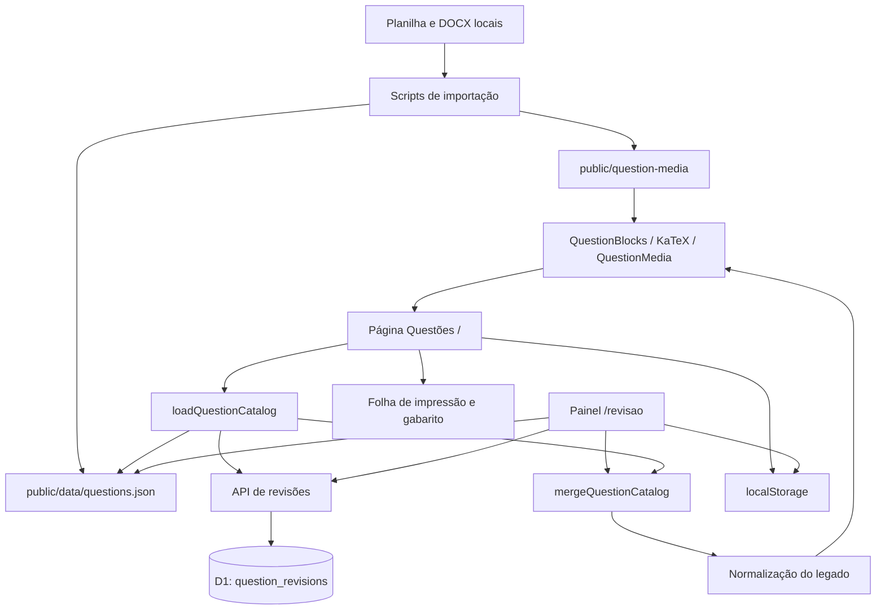
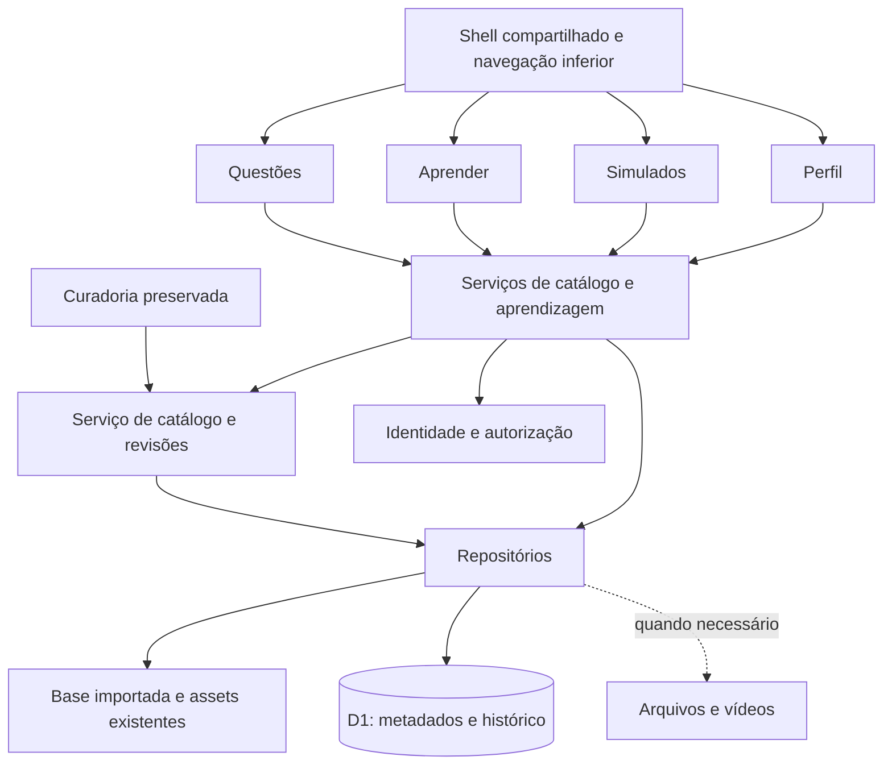

# SimpleQuest 2.0 — análise técnica e plano da Etapa 1

Data: 11 de setembro de 2026. Base examinada: commit `9155102`, com a árvore de trabalho inicialmente limpa.

Esta entrega conclui a primeira tarefa do briefing: diagnóstico do sistema existente, proposta de evolução e plano detalhado apenas da Etapa 1. Nenhum código da aplicação, configuração, dependência, catálogo ou migração foi modificado. As entidades e os diretórios futuros descritos abaixo são propostas; não foram implementados.

A recomendação é evoluir a aplicação atual, mantendo React, TypeScript, Vinext/Vite, D1, Drizzle e os componentes de questões. O primeiro incremento deve organizar a navegação e compartilhar o estado existente. A estrutura pedagógica e o histórico de aprendizagem entram depois, por adições compatíveis ao modelo atual.

## 1. Como o SimpleQuest funciona hoje

O produto atual atende principalmente à pesquisa e preparação de provas de Matemática do 6º ano, com curadoria de um acervo importado de documentos Word relacionados a uma planilha. Essa especialização aparece na interface e na origem dos arquivos; disciplina e ano escolar ainda não são entidades do modelo.

Há duas páginas de produto: a página inicial, com pesquisa e montagem de simulado, e o painel de revisão editorial. Não há atualmente páginas de aprendizagem, perfil do estudante ou realização de simulados com tentativa e resultado persistidos.

### Pesquisa e uso das questões

Na [página inicial](C:/Users/trans/Documents/SimpleQuest/app/page.tsx:27), o navegador carrega o catálogo, aplica filtros e apresenta dez questões por página. A pesquisa considera instituição, ano, número, assuntos e texto. O algoritmo de [busca](C:/Users/trans/Documents/SimpleQuest/app/search-utils.ts:93) normaliza acentos e pontuação, reconhece alguns sinônimos pedagógicos, aceita prefixos e tolera pequenos erros de escrita. A relevância vem antes da ordenação por ano ou instituição.

Os filtros disponíveis são **Prova**, **Ano**, **Assunto** e **Conteúdo**. O último significa situação editorial — autenticada, texto importado ou em revisão — e não o nível pedagógico “Conteúdo” pedido no briefing. Não existem ainda filtros hierárquicos por disciplina, área, conteúdo e subconteúdo; dificuldade e formato estão no modelo/editor, mas não na pesquisa principal.

Cada questão pode ser expandida, adicionada ao simulado e ter seu gabarito revelado. Ao escolher uma alternativa, a interface indica acerto ou erro imediatamente. A resposta é comparada com o gabarito no navegador e pode ser alterada ou desmarcada. Esse comportamento é uma prática local, sem registro de tentativas no servidor e sem explicação pedagógica estruturada.

### Montagem de provas e exportação

O painel “Simulado atual” reúne questões selecionadas, permite editar o título, remover itens e limpar a seleção. A lista lateral mostra até oito itens e o total excedente; a impressão inclui todos os selecionados. A ordem vem do catálogo, não da ordem dos cliques.

O botão de PDF chama [`window.print()`](C:/Users/trans/Documents/SimpleQuest/app/page.tsx:342): existe uma folha A4 específica com questões e gabarito em uma página separada. O usuário pode salvar em PDF pela impressão do navegador. Não há gerador de PDF no servidor, exportação DOCX, cronômetro ou sessão online de simulado. No painel de revisão existe exportação do catálogo efetivo em JSON.

### Revisão editorial

O [painel de revisão](C:/Users/trans/Documents/SimpleQuest/app/revisao/page.tsx:54) permite pesquisar a fila, filtrar instituição/situação, cadastrar questões e editar metadados, enunciado e alternativas. Trabalha com texto formatado, fórmulas, índices, tabelas e imagens em blocos ordenados. Inclui reordenação, exclusão de blocos, desfazer/refazer, rascunho, marcação como pronta, autenticação editorial, bloqueio, desbloqueio com justificativa e restauração do original.

“Autenticar” significa conferir editorialmente a questão. O nome do responsável é a constante `Administrador`; não comprova autenticação de usuário nem permissão administrativa. A auditoria registra autenticações e desbloqueios, não versões completas de todas as edições.

### Persistência atual

O catálogo efetivo é **JSON base + revisões do D1, sobrepostas pelo mesmo ID + normalização de compatibilidade**. Questões cadastradas manualmente entram nessa sobreposição. Excluir a revisão de uma questão importada revela novamente a base; excluir um cadastro manual remove esse cadastro.

Filtros, página, questão expandida, alternativas marcadas, gabaritos revelados, seleção, título do simulado e rolagem são gravados no `localStorage`, sob `simplequest:questions-view:v1`. A revisão tem `simplequest:review-view:v1`, com filtros, item selecionado e posições de rolagem. O texto de uma edição ainda não salva não é persistido nessa chave.

Esses estados pertencem ao navegador, sem separação por conta ou sincronização entre dispositivos. O botão de avatar “PR” não abre um perfil funcional. O indicador `Ctrl K` é visual: não foi localizado um atalho implementado.

### Acervo verificado

Contagens calculadas sobre todo o [JSON atual](C:/Users/trans/Documents/SimpleQuest/public/data/questions.json), e não copiadas dos números fixos da interface:

| Indicador | Resultado |
| --- | --- |
| Questões / IDs distintos | 1.217 / 1.217 |
| Instituições/fontes e período | 9; 2003–2024 |
| Tamanho do JSON sem compressão | 3.917.004 bytes, aproximadamente 3,74 MiB |
| Situação editorial | 660 `ready`; 557 `review` |
| Autenticadas e bloqueadas na base | 295 |
| Assuntos distintos / questões sem assunto | 161 / 160 |
| Formato declarado | 1.217 `ABCDE`; o código também suporta `ABCD` e `CE` |
| Gabaritos vazios | 160 |
| Outros gabaritos incompatíveis com uma alternativa A–E | 12: dez marcações de anulação e duas sequências de C/E |
| Dificuldade vazia | 1.173; também há `Média`, `Médio` e `Anulada` nesse campo |
| Imagens WebP locais | 450; todas as 450 URLs distintas referenciadas foram encontradas |
| Blocos de fórmulas / tabelas | 1.070 / 126 |
| Mídias pendentes | 10 blocos em seis questões |

O banco SQLite de desenvolvimento foi aberto em modo somente leitura: contém 295 revisões, todas bloqueadas e nenhuma marcada como cadastro manual. A mesclagem com esse banco mantém 1.217 questões, 660 prontas e 557 em revisão. Há 172 gabaritos incompatíveis com correção de alternativa única; cem estão em questões `ready` e um em uma questão bloqueada. Portanto, nem `ready` nem o bloqueio editorial garantem, isoladamente, aptidão para correção automática.

O [arquivo de estatísticas](C:/Users/trans/Documents/SimpleQuest/public/data/stats.json) ainda registra 543 prontas e 674 em revisão, divergindo do catálogo. Não foi localizado consumo desse arquivo pela aplicação. Os 1.253 itens de backlog aparecem na interface e correspondem à diferença entre 2.470 registros históricos catalogados e 1.217 vinculados; não constituem uma fila persistida de importação na aplicação.

## 2. Mapa da arquitetura atual

### Stack e execução

| Camada | Implementação observada |
| --- | --- |
| UI | React 19.2.6, TypeScript 5.9.3, componentes funcionais e hooks |
| Rotas e renderização | Convenções de Next App Router; execução por Vinext 0.0.50 sobre Vite 8.0.13 |
| Compatibilidade Next | Dependência Next 16.2.6; uso de `next/link`, `next/headers` e `next/navigation` |
| Servidor | Worker Cloudflare que delega ao handler App Router do Vinext |
| Dados persistidos | Cloudflare D1, binding lógico `DB`; Drizzle ORM 0.45.2 e Drizzle Kit 0.31.10 |
| Estilos | Tailwind CSS 4.2.1 importado, com interface majoritariamente em CSS global próprio |
| Matemática | KaTeX para exibição; MathLive carregado dinamicamente para edição |
| Assets | JSON e imagens em `public`; R2 não habilitado |
| Ferramentas | npm e lockfile; scripts auxiliares Python, XML/ZIP e Pillow para importação |

Fontes: [package.json](C:/Users/trans/Documents/SimpleQuest/package.json), [Vite](C:/Users/trans/Documents/SimpleQuest/vite.config.ts), [Worker](C:/Users/trans/Documents/SimpleQuest/worker/index.ts:29) e [configuração Sites](C:/Users/trans/Documents/SimpleQuest/.openai/hosting.json).

Não é um projeto executado por `next build`: os scripts chamam `vinext`. O plugin [sites-vite-plugin.ts](C:/Users/trans/Documents/SimpleQuest/build/sites-vite-plugin.ts:18) é código-fonte de infraestrutura, embora esteja em `build/`; ele empacota metadados e migrações em `dist/.openai`. Não deve ser tratado como resíduo descartável.



### Rotas, contratos e fronteiras

| Rota ou recurso | Responsabilidade e comportamento atual |
| --- | --- |
| `/` | Página cliente: catálogo, filtros, cartões, correção local, seleção e impressão |
| `/#questoes`, `/#simulado`, `/#top` | Âncoras da página inicial, não rotas independentes |
| `/revisao` | Página cliente de curadoria, cadastro e exportação JSON |
| `GET /api/questions/revisions` | Retorna `{ questions }` com todas as revisões, ordenadas por `updatedAt` decrescente |
| `POST /api/questions/revisions` | Recebe uma questão completa e faz inserção/atualização por ID; retorna `{ question }` |
| `DELETE /api/questions/revisions?id=...` | Remove a revisão ou cadastro; retorna `{ ok: true }`; bloqueia remoção de linha travada |
| `/data/questions.json` e `/question-media/*` | Assets do acervo, incluindo gabaritos no JSON |
| `/_vinext/image` | Endpoint de otimização previsto no Worker; as imagens de questões usam `` diretamente |

O [layout raiz](C:/Users/trans/Documents/SimpleQuest/app/layout.tsx:28) só envolve `children`, importa estilos e define metadados. Não há hoje um shell de produto compartilhado entre as páginas. Os cabeçalhos são duplicados.

O [helper de identidade](C:/Users/trans/Documents/SimpleQuest/app/chatgpt-auth.ts:21) existe, mas nenhuma página ou API atual o utiliza. As rotas de entrada/saída de identidade mencionadas nesse helper pertencem à infraestrutura Sites. Não são rotas implementadas neste repositório. A configuração local não contém `project_id`, portanto não permite determinar qual publicação e política de acesso estão ativas.

### Modelo e banco

O [tipo `Question`](C:/Users/trans/Documents/SimpleQuest/app/question-model.ts:34) combina proveniência, classificação textual, resposta, conteúdo legado, blocos ricos e estado editorial. O [schema D1](C:/Users/trans/Documents/SimpleQuest/db/schema.ts:4) possui uma única tabela de produto, `question_revisions`, com 33 colunas. Listas e blocos são JSON serializado em colunas `TEXT`. Não há tabela canônica com todas as questões no D1, usuários, tentativas, conteúdos educacionais ou relacionamentos pedagógicos.

Existem quatro migrações SQL, de `0000` a `0003`. Além delas, [`ensureQuestionRevisionTable()`](C:/Users/trans/Documents/SimpleQuest/db/index.ts:15) cria tabela, índices e colunas em tempo de requisição, inclusive no GET. Os índices de status e instituição/ano existem no banco local, mas não estão declarados no schema Drizzle nem nas quatro migrações. O journal contém quatro entradas; os snapshots disponíveis terminam em `0001`.

### Organização e tamanho

| Arquivo ou diretório | Papel |
| --- | --- |
| `app/page.tsx` | Cerca de 377 linhas: praticamente toda a experiência de pesquisa e simulado |
| `app/revisao/page.tsx` | Cerca de 656 linhas: carregamento, fila, editor, histórico e persistência |
| `app/question-model.ts` | Tipos, adaptação do legado, reparo de importação, mesclagem e acesso HTTP no mesmo módulo |
| `app/components/` | Seis componentes de conteúdo, mídia e edição matemática |
| `app/components/InlineMathEditor.tsx` | Cerca de 1.071 linhas: editor e algoritmos de seleção/cursor/DOM |
| `app/globals.css` | Cerca de 519 linhas e 50 KB; tema, páginas, editor, responsividade e impressão |
| `db/`, `drizzle/` | Acesso ao D1, schema e evolução do banco |
| `worker/`, `build/` | Runtime e empacotamento Sites |
| `scripts/` | Extração, renomeação e dimensões de mídias |
| `tests/` | Testes de busca, catálogo e verificações textuais do código |
| `examples/d1/` | Exemplo de notas do starter; não é uma rota ativa do produto |
| `work/` | Fontes Word/planilha, análises históricas, scripts auxiliares e arquivos intermediários ignorados pelo Git |

Os scripts de importação foram lidos, sem executá-los. A extração interpreta bookmarks, tabelas e matemática OMML de DOCX; formatos gráficos não convertidos permanecem como `pending-media`. A etapa anterior de construção do catálogo está em `work/scripts/build_catalog.py`, ignorada pelo Git. Alguns auxiliares usam caminhos absolutos ou anteriores à organização em `work/`. A reprodução da importação ainda depende desse material local e não está integralmente documentada/versionada.

### Estilos e mobile atual

A identidade visual combina azul-marinho, verde-petróleo, superfícies claras e fontes serifadas para enunciados. Deve ser reaproveitada. A responsividade usa ajustes em 1.040 px e 760 px sobre uma composição inicialmente desktop.

Em telas menores, o simulado é deslocado para antes dos resultados; o primeiro link do cabeçalho e o avatar são escondidos. O botão de exportar acervo também é escondido na revisão mobile. Há diversos rótulos de 8–11 px e botões pequenos no editor. Ainda não há barra inferior, tratamento de área segura, manifesto de instalação ou service worker.

## 3. Funcionalidades que devem ser preservadas

| Capacidade | Compromisso para a evolução |
| --- | --- |
| Catálogo e proveniência | Manter IDs, `sourceRow`, documento, bookmark e todas as mídias existentes |
| Sobreposição de revisões | Continuar respeitando o D1 sobre a base e a inclusão de cadastros manuais |
| Normalização do legado | Manter fórmulas nas alternativas, reparos específicos e composição de texto |
| Busca | Preservar acentos, sinônimos, prefixos, tolerância a erros, relevância, filtros e ordenação |
| Navegação do acervo | Manter paginação, expansão, gabarito e recuperação do estado ao retornar |
| Prática local | Preservar seleção de alternativa e indicação imediata, sem tratá-las como histórico validado |
| Simulado atual | Manter seleção, título, remoção, limpeza e disponibilidade entre as novas áreas |
| Impressão/PDF | Preservar versão do aluno, alternativas, fórmulas, tabelas, imagens e gabarito separado |
| Curadoria | Manter `/revisao`, busca/fila, cadastro, rascunho e publicação editorial |
| Edição rica | Manter ordem dos blocos, formatação, alinhamento, matemática, imagens, tabelas e desfazer/refazer |
| Confiança editorial | Preservar bloqueio, desbloqueio com motivo e registros existentes; reforçar autorização separadamente |
| Restauração e exportação | Manter restauração da versão base, exclusão de cadastro manual e exportação JSON |
| Desktop | Preservar o uso eficiente em tela ampla, incluindo acesso rápido ao simulado e à curadoria |

Preservar capacidades não exige manter erros conhecidos. A futura correção automática deve tratar questões sem gabarito válido como não corrigíveis; não deve contabilizar toda resposta como erro, como pode acontecer hoje. Essa correção pertence ao preparo da integração pedagógica, sem alteração silenciosa dos dados históricos nesta análise.

## 4. Componentes e lógica reutilizáveis

| Peça existente | Reaproveitamento recomendado |
| --- | --- |
| [QuestionBlocks](C:/Users/trans/Documents/SimpleQuest/app/components/QuestionBlocks.tsx:164) | Renderizador de questões em pesquisa, feed, simulado e impressão; manter o contrato de blocos |
| [QuestionMedia](C:/Users/trans/Documents/SimpleQuest/app/components/QuestionMedia.tsx:11) | Imagens com dimensões, escala, exibição opcional, ampliação e modo de impressão |
| [MathFormula / InlineMath](C:/Users/trans/Documents/SimpleQuest/app/components/MathFormula.tsx:3) | Matemática em questões, microconteúdos e cartões de revisão; KaTeX já usa `trust: false` |
| [ContentBlocksEditor](C:/Users/trans/Documents/SimpleQuest/app/components/ContentBlocksEditor.tsx:41) | Base da curadoria de conteúdos ricos, sem reescrever o editor na Etapa 1 |
| [FormulaEditor](C:/Users/trans/Documents/SimpleQuest/app/components/FormulaEditor.tsx:7) | Edição visual de fórmulas com MathLive importado sob demanda |
| [InlineMathEditor](C:/Users/trans/Documents/SimpleQuest/app/components/InlineMathEditor.tsx:466) | Preservar seleção e cursor; decomposição interna somente em trabalho específico com testes de interação |
| [search-utils](C:/Users/trans/Documents/SimpleQuest/app/search-utils.ts:1) | Compartilhar busca de questões e curadoria; manter testes comportamentais |
| [question-model](C:/Users/trans/Documents/SimpleQuest/app/question-model.ts:81) | Manter adaptadores e funções puras; separar acesso HTTP apenas quando houver necessidade |
| Tokens e impressão em [globals.css](C:/Users/trans/Documents/SimpleQuest/app/globals.css:1) | Reutilizar tema e impressão; novos estilos podem ser isolados por módulo |
| [chatgpt-auth](C:/Users/trans/Documents/SimpleQuest/app/chatgpt-auth.ts:21) | Possível adaptador de identidade no ambiente Sites, com verificação de papel no servidor |

Há também peças úteis ainda embutidas na página inicial: cartão de questão, alternativas e feedback, barra de filtros, paginação, painel de seleção e folha de impressão. A Etapa 1 deve extraí-las progressivamente, mantendo comportamento e renderizadores.

Nem todo o modelo visual de questões deve virar um modelo universal. Vídeos precisam de duração, URL, legendas, transcrição e eventos próprios. Um conteúdo educacional pode reutilizar blocos de texto/matemática sem receber artificialmente `school`, `year`, `number` ou `answer`.

## 5. Alterações necessárias no banco

**A Etapa 1 não exige migração de banco.** As propostas desta seção entram conforme a etapa que as utilizar. Não criar todas as tabelas vazias antecipadamente.

### Limitações que orientam as adições

`subjects` representa assuntos livres e mistura conceitos, formatos, descrições e anulações. Não é possível interpretá-lo como disciplina nem extrair automaticamente os cinco níveis pedagógicos sem revisão. `difficulty` mistura dificuldade com anulação. `answerType` descreve o conjunto de alternativas, não todos os futuros tipos de exercício.

Além disso, IDs de questões existentes apenas no JSON não podem ser alvos de uma chave estrangeira no D1. É necessário um registro canônico de identidade para relacioná-los a conteúdos, eventos e simulados. `question_revisions` não deve desempenhar esse papel: muitas questões não têm revisão, e restaurar uma revisão não deve apagar o histórico de estudo.

### Base pedagógica — Etapa 2

| Entidade proposta | Campos/relações essenciais e finalidade |
| --- | --- |
| `question_registry` | `id` igual ao ID atual, origem importada/manual, versão da fonte e ativo/arquivado. Identidade permanente de todas as questões, independente da existência de uma revisão |
| `taxonomy_nodes` | ID, tipo `discipline/area/topic/subtopic/skill`, nome, slug, pai, ordem e ativo. Modela Disciplina → Área → Conteúdo → Subconteúdo → Habilidade |
| `taxonomy_aliases` | Rótulo legado, origem/contexto, nó correspondente e situação da conferência. Permite normalização gradual sem apagar `subjects` |
| `question_taxonomy` | Relação N:N entre `question_registry` e nós pedagógicos, com origem e situação da associação |
| `question_learning_metadata` | Uma linha por questão: dificuldade normalizada opcional, validade ativa/anulada/a conferir, modo de correção e elegibilidade pedagógica. Campos adicionais, separados dos metadados legados |
| `educational_contents` | ID, tipo, título, resumo, blocos, idioma, duração estimada, rascunho/publicado/arquivado, versão, autoria e datas. Vídeos têm URL, duração real, poster, legendas e transcrição opcionais |
| `content_taxonomy` | Relação N:N entre conteúdo educacional e qualquer nível da taxonomia |

Em `taxonomy_nodes`, disciplina não tem pai; cada outro nível exige pai do nível imediatamente anterior. Além de chaves estrangeiras e valores enumerados, validar essa relação no serviço e protegê-la no banco quando necessário. A tipagem dos níveis impede ciclos quando respeitada. Associações podem começar apenas na disciplina ou no conteúdo conhecido: não inventar habilidades para completar a árvore.

O material atual pode receber uma associação ampla a Matemática quando sua proveniência confirmar isso. Rótulos como `Médio/Média`, `Regra deTrês/Regra de Três` e grafias variantes entram em uma tabela de correspondência conferível. Valores como `?`, `ANULADA` e `Nenhum` não devem virar nós pedagógicos.

O registro canônico pode ser inicialmente leve. Na integração de questões reais e paginação no servidor, adicionar um snapshot versionado da base importada, ou tabela equivalente, mantendo o ID e a sobreposição das revisões. O momento de trocar a fonte de leitura deve ter comparação de paridade; não é necessário migrar o acervo inteiro para mudar a navegação.

### Feed, identidade e aprendizagem — Etapas 3 a 5

| Entidade proposta | Finalidade |
| --- | --- |
| `learning_items` | Identidade comum do item do feed. Aponta exclusivamente para uma questão ou um conteúdo, com chaves estrangeiras, unicidade e restrição de exclusividade |
| `learner_profiles` | ID interno, identificador do provedor de identidade, nome de exibição, fuso e datas. Não usar e-mail como chave estável |
| `learner_disciplines` e preferências | Disciplinas escolhidas e preferências persistidas por estudante |
| `learning_events` | ID único do evento, estudante, item, sessão, tipo, versão do conteúdo, horário observado/recebido e payload limitado/versionado |
| `question_attempts` | Estudante, questão e versão, resposta, resultado correto/incorreto/não corrigível e contexto de prática ou simulado |
| `learning_item_states` | Relação única estudante/item para favorito, conclusão e última visualização; estado consultável derivado ou atualizado junto dos eventos |

Eventos previstos: `content_viewed`, `video_started`, `video_completed`, `video_skipped`, `question_answered`, `answer_correct`, `answer_incorrect`, `content_favorited` e `content_completed`. A remoção de favorito também precisa de evento correspondente. Para questão respondida, os eventos de resultado devem derivar de uma única tentativa validada; não contar os três eventos como três práticas.

O servidor determina o estudante pela sessão e o resultado pelo gabarito/versionamento. IDs de idempotência evitam duplicação em reenvios. Pausa e saída da tela não são conclusão de vídeo. A regra de visualização deve exigir exposição real do item, não apenas que ele tenha sido baixado na paginação.

Para perfis no Sites, o helper atual pode fornecer identidade, sujeito à confirmação do ambiente de publicação. Papéis editoriais são uma verificação adicional. Para público fora desse ambiente, manter uma interface de identidade substituível e definir o provedor antes de registrar dados pessoais persistentes. Isso não exige iniciar um novo sistema de login na Etapa 1.

### Progresso, trilhas, domínio e gamificação — Etapa 6 em diante

| Entidade proposta | Finalidade |
| --- | --- |
| `learning_paths` e `learning_path_steps` | Trilha ordenada que conecta itens e objetivos pedagógicos; taxonomia classifica, trilha organiza estudo |
| `learner_path_progress` | Progresso por estudante e trilha, baseado em passos concluídos |
| `learner_mastery` | Chave estudante/nó, estimativa anulável de 0 a 1, número de evidências, versão do método e última atualização |
| `xp_ledger` e resumo de progresso | Créditos associados a eventos/tentativas elegíveis, com unicidade para evitar recompensa repetida |
| Conquistas e desafios | Definição e concessão por critérios verificáveis, adicionadas quando essa experiência for implementada |

Sem evidência, domínio deve ser desconhecido, não 0%. Um percentual de acertos pode ser exibido como percentual de acertos; não deve receber o nome de “domínio” sem um método explícito. A estrutura proposta comporta a evolução futura sem implementar agora estimadores sofisticados.

Sequência diária depende de atividade de aprendizagem elegível no fuso do estudante. XP e níveis derivam de prática e conclusão com critérios definidos; não de minutos com a página aberta. O livro de créditos permite revisão de regras e evita somar XP duas vezes por reenvio.

### Simulados — Etapa 7

Prever `exam_objectives`, `simulations`, `simulation_questions`, `simulation_attempts` e respostas relacionadas às tentativas. Guardar proprietário, configuração, objetivo, quantidade, dificuldade, estado, ordem e versão/snapshot das questões. A correção e a reprodução de um resultado histórico devem usar a versão respondida, mesmo se a questão for editada depois.

Exportações futuras podem ter `export_jobs` com formato, versão do simulado, estado e localização do arquivo. PDF e DOCX devem consumir um modelo de documento comum. O PDF por impressão existente continua disponível até que outra implementação prove paridade.

### Migração compatível e integridade

1. Manter JSON, revisões, campos legados, IDs e arquivos originais como referência. Novos cadastros podem adotar UUID; IDs existentes nunca devem ser regenerados a partir de nome/linha de planilha.
2. Criar tabelas e associações novas de forma aditiva. Não fazer chaves estrangeiras de tentativas dependerem de uma linha removível de revisão.
3. Fazer preenchimento inicial em lotes idempotentes, separado das migrações de schema. Registrar origem, versão e ambiguidades; não substituir classificações manuais confirmadas.
4. Validar contagens, relações, conteúdo rico, revisão efetiva e restauração antes de alterar a fonte de leitura.
5. Verificar o histórico real de migrações por ambiente e corrigir o processo de geração, que hoje tem snapshots incompletos. Não editar migrações já aplicadas para “arrumar” o histórico.
6. Passar a administrar schema por migrações e retirar DDL de requisições em uma mudança própria, depois de garantir que os ambientes estejam atualizados. A migração não deve disputar a criação da mesma coluna com `ensureQuestionRevisionTable()`.
7. Adicionar índices conforme consultas reais: pai/tipo da taxonomia, relações por nó e questão, histórico por estudante/data, estado por estudante/item e tentativas por estudante/questão. Conferir planos de execução; não indexar todo campo por antecipação.

Migrações versionadas e índices orientados pelas consultas são compatíveis com o D1 atual. As escolhas acima são propostas para o SimpleQuest, apoiadas nas práticas documentadas de [migrações D1](https://developers.cloudflare.com/d1/reference/migrations/) e [índices D1](https://developers.cloudflare.com/d1/best-practices/use-indexes/).

## 6. Proposta de arquitetura do SimpleQuest 2.0

Adotar uma aplicação modular única. As rotas compõem as telas, componentes exibem e capturam interação, hooks cuidam do estado de interface, serviços executam regras e repositórios acessam dados. Não há justificativa nesta fase para microserviços, trocar de framework ou substituir o editor.



### Rotas de produto

| Rota | Etapa 1 | Evolução posterior |
| --- | --- | --- |
| `/` | Questões, preservando a URL atual | Explorar; Praticar quando houver seleção automática |
| `/aprender` | Área inicial honesta, sem feed fictício | Feed vertical paginado e conteúdos/trilhas |
| `/simulados` | Montagem e impressão com a seleção existente | Geração por filtros/objetivo, realização e resultados |
| `/perfil` | Área de perfil com estado inicial e informação sobre dados locais | Preferências por estudante, progresso, trilhas, estatísticas, histórico e conquistas |
| `/revisao` | Curadoria preservada, acessível por ação secundária | Controle de acesso editorial e cadastro de conteúdos |

Manter `/` como Questões evita redirecionamentos e quebra de favoritos. Não é necessário criar `/questoes` na primeira etapa. Também não se deve transformar `/revisao` em revisão espaçada do estudante: o significado atual é curadoria. Uma futura revisão pedagógica pode ser parte de `/aprender` ou uma subrota própria.

Novas APIs entram quando usadas: catálogo paginado em `/api/questions`, taxonomia em `/api/taxonomy`, feed em `/api/learning/feed`, tentativas em `/api/learning/attempts`, eventos em `/api/learning/events`, perfil em `/api/me`, progresso em `/api/me/progress` e simulados em `/api/simulations`. Preservar o contrato de `/api/questions/revisions` enquanto existirem consumidores legados. As rotas pessoais sempre derivam a identidade no servidor.

### Feed determinístico

O feed deve usar um contrato de item que discrimine vídeo, questão, microexplicação, revisão e desafio. Os renderizadores são pequenos; questão utiliza `QuestionBlocks` e o componente de alternativas reaproveitado. A demonstração da Etapa 3 pode usar um repositório em memória/arquivo com o mesmo contrato de paginação, identificado como demonstração.

A política inicial deve filtrar disciplinas selecionadas e conteúdo publicado/elegível, excluir itens vistos recentemente e intercalar tipos em uma ordem previsível. Usar desempate estável por ID e cursor opaco associado aos filtros e à versão da sessão. Evitar aleatoriedade nova a cada página: ela produz repetições e lacunas. Se um tipo acabar, usar os outros elegíveis; se o conjunto acabar, mostrar conclusão da sessão em vez de repetir silenciosamente.

Carregar a próxima página antes do fim por observação de proximidade, com uma única requisição em andamento, deduplicação por ID e cancelamento quando os filtros mudarem. Reter uma janela de conteúdo suficiente para voltar; controlar a quantidade de vídeos montados. O histórico recente pode ser local na demonstração e passa a persistido na Etapa 5.

A experiência deve permitir avançar e voltar por rolagem e controles acessíveis, pausar vídeos fora da área ativa e concluir/favoritar explicitamente. Conteúdos longos precisam continuar legíveis, sem corte para caber em uma altura rígida. Um item de questão sem resposta verificável não gera acerto/erro nem XP. Explicações só aparecem quando cadastradas.

### Estado e contratos compartilhados

Na Etapa 1, manter estado transitório no cliente e compatibilidade com as chaves atuais. Uma única camada deve ser proprietária da escrita da chave compartilhada por questões e simulado. Duas páginas gravando cópias independentes podem apagar a seleção uma da outra.

Posteriormente, separar claramente estado de tela, rascunho local, perfil persistido e registros de aprendizagem. Favoritos, conclusão, tentativas e progresso devem usar D1 quando prometidos como dados da conta. O cliente não é autoridade sobre identidade, acerto ou XP.

A curadoria segue como domínio próprio. Separar auditoria editorial de eventos do aluno evita confundir “questão revisada pelo administrador” com “conteúdo revisado pelo estudante”.

### Mídia e exportações

Manter as imagens existentes em seus caminhos. Vídeos iniciais podem ser cadastrados por URL com metadados; quando houver armazenamento próprio, guardar bytes em R2 e metadados no D1, avaliando entrega, compatibilidade e direitos de uso do conteúdo escolhido. Não embutir vídeos ou arquivos base64 na tabela de eventos.

No runtime Worker, usar acesso a assets/bindings e APIs compatíveis. Scripts Python de importação permanecem ferramentas de preparação local; não podem ser simplesmente chamados por um endpoint do Worker.

### Web App e PWA

O primeiro incremento deve funcionar como Web App responsivo e preparar instalação com manifesto, ícones e metadados de viewport. Operação offline completa, sincronização de respostas e cache de vídeos exigem trabalho próprio e não são parte da navegação inicial.

A instalação varia por navegador; manifesto e HTTPS são requisitos centrais nos navegadores compatíveis. Um service worker pode acrescentar operação offline, mas não é requisito universal para instalação. Por isso, não se propõe um cache global de páginas autenticadas na Etapa 1. Referência: [MDN — tornar uma PWA instalável](https://developer.mozilla.org/en-US/docs/Web/Progressive_web_apps/Guides/Making_PWAs_installable).

## 7. Estrutura de diretórios recomendada

A árvore a seguir é um destino incremental. Criar somente os arquivos necessários à etapa em execução. Os caminhos sem equivalente atual são propostas, não arquivos existentes.

```text
app/
  layout.tsx                      # HTML, estilos e metadados; continua servidor
  providers.tsx                   # fronteira cliente para estado compartilhado
  globals.css                     # tokens/base e compatibilidade dos estilos atuais
  (plataforma)/
    layout.tsx                    # shell, navegação e saída de impressão
    page.tsx                      # Questões em /
    aprender/page.tsx
    simulados/page.tsx
    perfil/page.tsx
  revisao/page.tsx                # mantém /revisao
  api/
    questions/revisions/route.ts  # contrato atual preservado
    questions/route.ts           # futuro catálogo paginado
    taxonomy/route.ts             # futuro
    learning/feed/route.ts        # futuro
    learning/events/route.ts      # futuro
    learning/attempts/route.ts    # futuro
    me/route.ts                   # futuro
    me/progress/route.ts          # futuro
    simulations/route.ts         # futuro
  components/
    shell/
      AppShell.tsx
      AppHeader.tsx
      BottomNavigation.tsx
      shell.module.css
    QuestionBlocks.tsx           # manter localização inicial
    QuestionMedia.tsx
    MathFormula.tsx
    FormulaEditor.tsx
    ContentBlocksEditor.tsx
    InlineMathEditor.tsx
  question-model.ts               # compatibilidade inicial preservada
  search-utils.ts
  chatgpt-auth.ts
features/
  questions/
    components/                  # Workspace, Filters, Card, Alternatives, Pagination
    hooks/                       # carregamento e estado de pesquisa
    state/                       # estado legado compartilhado e persistência segura
  simulations/
    components/                  # Composer, SelectionSummary, PrintSheet
    hooks/                       # acesso ao mesmo rascunho compartilhado
  learning/                      # feed e cartões, a partir da Etapa 3
  profile/                       # componentes da área Perfil
  taxonomy/                      # domínio pedagógico, a partir da Etapa 2
lib/
  server/                        # serviços, identidade e repositórios futuros
  validation/                    # contratos de entrada/saída quando necessários
db/
  index.ts
  schema.ts                      # continua entrada do Drizzle
  schemas/                       # módulos adicionados quando o schema crescer
drizzle/                         # histórico de migrações preservado
public/
  data/questions.json
  data/stats.json
  question-media/
  manifest.webmanifest           # proposto para a Etapa 1
  icons/                         # ícones de instalação propostos
scripts/                         # importação e manutenção; sem reexecução automática
tests/                           # busca, integridade e cenários reais de navegação
docs/
  simplequest-2.0-analise-tecnica.md
worker/index.ts
build/sites-vite-plugin.ts
.openai/hosting.json
```

Route groups preservam URLs e permitem aplicar um layout às quatro áreas, mantendo a revisão em sua composição atual. Esse mecanismo existe no código instalado do Vinext. Ainda assim, navegação, layouts e restauração devem ser validados na versão fixada, sem presumir compatibilidade completa com toda API Next. O projeto Vinext também ressalta limites de compatibilidade na [documentação oficial](https://github.com/cloudflare/vinext).

Evitar mover simultaneamente o modelo, todos os componentes, a revisão e os estilos. Na Etapa 1, a extração deve se concentrar na página inicial e nos pontos que precisam ser compartilhados. O diretório `lib/server` nunca deve ser importado pelo código cliente.

## 8. Riscos técnicos e limites da verificação

| Prioridade | Evidência e impacto | Tratamento recomendado |
| --- | --- | --- |
| Alta, antes de exposição multiusuário | A API editorial não chama o helper de identidade nem verifica papéis. Ator e auditoria vêm do payload | Autorizar escritas no servidor e atribuir ator/hora ali. Política externa de acesso não substitui papel editorial |
| Alta, antes de confiar no bloqueio | O bloqueio da API consulta apenas a revisão D1, não a base. Também aceita atualização de dados de auditoria enviados pelo cliente | Validar estado editorial efetivo, manter transições explícitas e auditoria controlada pelo servidor |
| Alta, antes de pontuar aprendizagem | 172 gabaritos não são alternativas únicas A–E; `ready`/bloqueio não garantem validade | Regra explícita de elegibilidade, suporte a anuladas/não corrigíveis e revisão de formatos |
| Alta, na Etapa 1 | Seleção e filtros estão na mesma chave local; trocar de rota desmonta a página | Uma única fonte de estado e um único escritor; hidratação antes de persistir |
| Alta, na Etapa 1 | A folha de impressão fica fora de `.app-shell`, que é escondido por CSS de impressão | Manter um único alvo de impressão fora do shell; testar ambas as páginas que oferecem PDF |
| Alta, antes de novas migrações | DDL em requisições, snapshots incompletos e índices fora do schema | Conciliar histórico real e geração antes da Etapa 2; não alterar SQL já aplicado |
| Média/alta | POST faz leitura e depois upsert, sem controle de versão concorrente | Introduzir versão esperada e resposta de conflito em alteração própria; não usar última escrita silenciosa para históricos |
| Média/alta | `tsc` falha no estado atual | Regularizar diagnóstico de tipos e escopo de arquivos no início da implementação, sem trocar stack |
| Média | Catálogo inteiro é baixado; a busca difusa percorre as questões a cada alteração; GET retorna todas as revisões | Preservar comportamento inicialmente; separar contrato de catálogo e adotar paginação/índices no servidor ao ampliar o acervo |
| Média | JSON base inclui gabaritos e auditoria editorial | Na realização futura de simulados, não enviar gabarito antecipado; separar DTO público, tentativa e resposta de correção |
| Média | Inputs são convertidos com casts e validações parciais; JSON malformado pode invalidar a leitura de revisões | Validar limites, tipos, enumerações, URLs, gabaritos e estruturas de blocos nas fronteiras |
| Média | Carregamento base não verifica `response.ok`; falhas de revisão podem ser ocultadas pelo fallback | Mostrar erro recuperável ou uso da base sem revisões, preservando o que foi digitado |
| Média | `localStorage` sem proteção uniforme nas escritas e sem identidade | Tratar armazenamento indisponível e separar dados da conta quando a identidade for integrada |
| Média | `dirty` é apenas um aviso; escolher outra questão ou sair pode perder edição | Incluir proteção de saída ao introduzir novos caminhos de navegação na revisão |
| Média | O editor usa DOM, seleção, teclado e muitos detalhes específicos; telas novas podem afetar o CSS global | Evitar reescrita do editor; validar toque/teclado e isolar estilos novos |
| Média | Modal de imagem não implementa contenção/retorno explícito de foco; radios manuais não implementam navegação por setas | Melhorias acessíveis pontuais com verificação de interação, preservando conteúdo |
| Média | Fonte de importação e parte dos scripts estão em `work/`, fora do versionamento | Documentar dependências e tornar o pipeline reprodutível antes de novas importações em massa |
| Média | Vinext instalado se descreve como experimental; o ambiente depende de bindings Cloudflare | Validar a versão atual em mobile/desktop e Worker; não atualizar dependências como parte automática da navegação |
| Baixa/média | README ainda descreve schema vazio e teste de skeleton; números de estatísticas estão desatualizados | Atualizar documentação e calcular métricas a partir da fonte efetiva quando forem exibidas |

O retorno de erros da API também expõe mensagens técnicas diretamente, e os metadados constroem a origem a partir de headers de requisição. Na revisão de fronteiras do servidor, separar mensagem pública de diagnóstico e validar a origem usada nos metadados.

### O que foi verificado nesta análise

Foram examinados todos os arquivos próprios de aplicação, componentes, estilos, APIs, schema, migrações, configurações, Worker, plugin de build, exemplos, testes e scripts de manutenção. O catálogo foi percorrido integralmente por verificações estruturais; os scripts e a estrutura das fontes auxiliares de importação também foram inspecionados. Dependências e saídas geradas foram tratadas como infraestrutura, não como código de produto a reescrever.

| Verificação | Resultado e interpretação |
| --- | --- |
| `node --test tests/search.test.mjs tests/rendered-html.test.mjs` | **8 testes passaram**: cinco de busca e três de código/catálogo |
| Integridade de assets e fórmulas | Referências locais encontradas; dimensões e nomes verificados pelos testes; fórmulas do catálogo aceitas pelo KaTeX |
| Leitura local do D1 | Schema, índices e contagens inspecionados em modo somente leitura; mesclagem calculada sem gravar |
| `node node_modules/typescript/bin/tsc --noEmit --incremental false` | **Falhou**: erros da aplicação/runtime e inclusão de fontes auxiliares em `work/artifact-tool-node_modules` |
| Diagnóstico TypeScript com `work/` e `dist/` excluídos apenas em memória | Restaram oito diagnósticos: quatro usos do retorno de `prepareForEditing`, import/tipagem do D1, parâmetro implícito e tipos `Fetcher`/`D1Database` |
| Build, publicação e UI em navegador | Não executados nesta análise; não há afirmação de validação visual ou do ambiente de produção |

Os quatro diagnósticos da revisão decorrem da inferência de `type: string` nas alternativas de `prepareForEditing`, incompatível com o discriminante literal dos blocos. As ocorrências estão nas linhas 127, 166, 357 e 420 de [revisao/page.tsx](C:/Users/trans/Documents/SimpleQuest/app/revisao/page.tsx:127). A ausência de tipos Cloudflare afeta [db/index.ts](C:/Users/trans/Documents/SimpleQuest/db/index.ts:1) e [worker/index.ts](C:/Users/trans/Documents/SimpleQuest/worker/index.ts:6).

Apesar do nome, `rendered-html.test.mjs` não abre um navegador nem verifica o HTML renderizado: a maior parte confere trechos de código por expressão regular, além de validar catálogo e fórmulas. Esses testes serão sensíveis à extração de componentes. Devem ser ajustados sem perder verificações úteis, complementados por cenários de comportamento nos pontos alterados.

O script `npm test` faz build e executa apenas `rendered-html.test.mjs`; não inclui `search.test.mjs`. A execução direta dos oito testes nesta análise não equivale a afirmar que `npm test` ou o build passaram.

As contagens do D1 referem-se exclusivamente ao banco local encontrado. O banco de produção, a política de acesso da publicação, o desempenho em dispositivos reais e a fidelidade pedagógica de cada questão não foram auditados. A análise integral do código e da estrutura dos dados não substitui revisão visual de todos os documentos originais.

## 9. Ordem recomendada de implementação

Manter as oito etapas do briefing, com entregas independentes e critérios de saída. Resolver pré-requisitos técnicos dentro de mudanças pequenas e separadas, sem iniciar os recursos das etapas seguintes por antecipação.

| Etapa | Resultado esperado | Critério de saída |
| --- | --- | --- |
| 1. Estrutura mobile e navegação | Quatro áreas, shell, estado compartilhado, simulado atual preservado e instalação básica preparada | Navegar e retornar sem perda de estado; impressão e revisão preservadas; mobile e desktop verificados |
| 2. Modelo pedagógico | Identidades de questões, hierarquia e conteúdos educacionais com migrações aditivas | Classificar novas entidades sem alterar metadados legados; IDs, relações e migrações consistentes |
| 3. Feed de demonstração/manual | Feed vertical com tipos de item, filtros, paginação e ações básicas | Avançar/voltar, pausar, concluir e favoritar funcionam; sem repetição indevida na sessão |
| 4. Questões reais no feed | Adaptador do acervo efetivo e regras de elegibilidade | Mesmos enunciados, alternativas e mídias; gabaritos válidos e explicações quando disponíveis |
| 5. Eventos e histórico | Identidade, autorização, tentativas e interações persistidas | Isolamento por estudante, reenvio idempotente e histórico recuperável entre dispositivos |
| 6. Progresso e gamificação básica | Trilhas, progresso, XP simples e sequência diária | Métricas rastreáveis às práticas; sem recompensa por permanência e sem duplicação |
| 7. Simulados ampliados | Geração personalizada/por objetivo, realização, correção, histórico e exportações evolutivas | Reprodução de tentativas por versão; impressão existente preservada |
| 8. Personalização | Regras baseadas em histórico e estimativas progressivamente melhores | Explicabilidade, avaliação de aprendizagem e controle do estudante sobre preferências |

A proteção editorial deve preceder a disponibilização a estudantes, ainda que a implementação da navegação seja local. A consistência das migrações precede a Etapa 2. A validação do gabarito e do formato precede qualquer pontuação no feed ou em simulados.

## 10. Plano detalhado somente para a Etapa 1

### Objetivo e limites

Entregar a navegação **Questões · Aprender · Simulados · Perfil**, com uso confortável no celular, mantendo pesquisa, curadoria, edição e exportações existentes.

Esta etapa não implementa algoritmo de recomendação, taxonomia no banco, eventos persistidos, perfil de conta, domínio, XP ou novos modos de simulado. “Aprender” e “Perfil” terão destinos reais com estados iniciais claros, sem dados inventados nem controles que aparentem funcionalidades ainda ausentes. Simulados reutilizará uma função já existente e será uma área operacional desde esse incremento.

### Incremento 1A — preparar uma referência confiável

Registrar as rotas atuais e exemplos de questões com texto, fórmula inline, tabela, imagem em alternativa e bloqueio editorial. Usar uma cópia descartável do banco para futuras verificações de escrita. Salvar uma referência da saída de impressão antes de mover o markup.

Regularizar os tipos de `prepareForEditing`, os tipos do runtime Cloudflare e a inclusão indevida de `work/` no TypeScript em uma alteração preparatória pequena. Isso permite distinguir regressões da nova navegação de falhas já existentes. Não alterar modelos de dados ou lógica de negócio nessa preparação. Manter versões e lockfile, salvo dependência de tipos que se mostrar necessária e compatível.

Ajustar a execução dos testes para incluir a busca. Planejar os testes de extração por comportamento, evitando exigir que toda a lógica continue literalmente em `app/page.tsx`.

**Saída:** referência funcional definida e verificação de tipos utilizável, sem alteração do catálogo.

### Incremento 1B — extrair os blocos que serão compartilhados

Extrair da página inicial `QuestionsWorkspace`, `QuestionFilters`, `QuestionCard`, `QuestionAlternatives` e `QuestionsPagination`. O componente de alternativas recebe resposta atual e callbacks; o cartão não passa a buscar dados por conta própria. Manter `QuestionBlocks`, `QuestionMedia`, o modelo e o algoritmo de busca em seus caminhos atuais.

Extrair `SimulationComposer`, `SimulationSelectionSummary` e `SimulationPrintSheet`. Reutilizar esses componentes na página de Simulados e, quando apropriado, no painel desktop de Questões. Preservar a ordem atual da seleção na impressão; reordenação manual seria funcionalidade de uma etapa posterior.

Introduzir `useQuestionCatalog` para compartilhar o carregamento entre Questões e Simulados, preservando mesclagem e normalização. A curadoria mantém inicialmente seu carregamento próprio; ao retornar dela, o catálogo deve ser atualizado para refletir edições salvas. Definir um estado recuperável de erro, distinguindo base indisponível de revisões indisponíveis.

**Saída:** mesmos resultados e mesma impressão, com responsabilidades extraídas; sem novo banco.

### Incremento 1C — compartilhar estado sem perder dados locais

Criar um provider cliente de sessão de questões na raiz, consumido por hooks de pesquisa e simulado. Ele é o único responsável por ler e escrever `simplequest:questions-view:v1` durante a Etapa 1. Preservar todos os campos atuais; não criar duas cópias independentes da seleção em chaves diferentes.

O provider deve hidratar o estado antes da primeira gravação, serializar `Set` como lista e tratar JSON inválido ou armazenamento bloqueado. Na ausência de armazenamento, a navegação continua funcionando em memória, sem prometer persistência após recarga.

Guardar a rolagem de Questões somente quando essa área estiver ativa. Ao entrar em uma nova área, posicionar o foco e a rolagem de forma apropriada; ao retornar, restaurar Questões depois que o catálogo e os cartões estiverem prontos. Não sobrescrever a rolagem de Questões enquanto o estudante rola Simulados ou Perfil.

Manter `simplequest:review-view:v1` e a recuperação da fila. A nova navegação não deve perder edições pendentes: integrar um aviso de saída baseado em `dirty` para os caminhos de saída da revisão, incluindo retorno à plataforma e fechamento/recarregamento quando suportado.

**Saída:** adicionar uma questão, abrir Simulados, editar o título e retornar mantém seleção, filtros, respostas, expansão e posição.

### Incremento 1D — instalar o shell e as quatro rotas

Manter `app/layout.tsx` como componente servidor responsável por documento/metadados. Criar um route group `(plataforma)` com layout compartilhado, mover a composição de Questões para seu `page.tsx` e acrescentar `/aprender`, `/simulados` e `/perfil`. Evitar duas páginas que resolvam simultaneamente para `/`.

`AppShell` define cabeçalho compacto, área principal e barra inferior. `BottomNavigation` usa links reais, rótulos visíveis, ícones simples e `aria-current="page"`, calculado pela rota. A barra permanece disponível nas quatro áreas em mobile e desktop; no desktop pode ter largura limitada, mantendo os mesmos destinos. Não duplicar navegações principais concorrentes.

Questões continua em `/`. Preservar `#top`, `#questoes` e `#simulado`: a última âncora pode apontar para o resumo da seleção e acesso ao compositor, conservando favoritos antigos. `/revisao` continua independente e acessível por “Revisar acervo” no cabeçalho ou em uma ação secundária de Perfil. Não criar uma quinta aba principal.

**Saída:** todas as rotas abrem diretamente, recarregam corretamente e funcionam com voltar/avançar do navegador.

### Incremento 1E — adaptar cada área

| Área | Comportamento concreto nesta etapa |
| --- | --- |
| Questões | Priorizar busca e resultados no celular; reduzir o espaço do hero preservando acesso às informações do acervo; manter filtros e todas as ações dos cartões |
| Aprender | Página inicial indicando que os conteúdos estão sendo preparados, com acesso funcional à prática por questões; sem vídeos de exemplo ou feed nesta etapa |
| Simulados | Exibir e editar o mesmo simulado atual: título, seleção, remoção, limpeza e impressão/PDF; estado vazio com link para selecionar questões |
| Perfil | Destino próprio, com estado inicial sem identidade fictícia, informação de que o estado atual é local e acesso às opções já existentes; progresso, trilhas e conquistas aguardam dados reais |
| Revisão | Manter editor, fila e URLs; garantir acesso às ações existentes no celular, inclusive exportar acervo, hoje escondido pelo CSS |

No desktop, Questões pode conservar seu painel lateral de seleção. No celular, usar um resumo compacto vinculado à área Simulados para evitar que o compositor ocupe o espaço antes dos resultados. O compositor completo permanece acessível na sua área.

O acesso à revisão não deve ser descrito como seguro apenas por estar em uma ação secundária. Reforço de autorização exige servidor e política de acesso; é um pré-requisito separado para distribuição multiusuário.

**Saída:** as quatro abas possuem destinos coerentes e as duas capacidades existentes — questões e montagem — continuam plenamente acessíveis.

### Incremento 1F — responsividade, acessibilidade e instalação

Adicionar estilos do shell isolados, preservando os tokens de cor. Dimensionar controles de navegação para toque, com alvo de pelo menos 44 × 44 px; utilizar corpo legível e rótulos que não dependam dos tamanhos pequenos atuais. Manter ícone e texto na barra, foco visível e contraste de estados.

Reservar no conteúdo a altura da barra mais `env(safe-area-inset-bottom)`. Usar unidades de viewport adequadas à altura dinâmica do navegador onde necessário, sem impor altura fixa às questões. Testar teclado virtual, retrato/paisagem, textos ampliados e conteúdo matemático largo. Somente tabelas/fórmulas que precisam devem ter rolagem horizontal interna.

Desativar rolagem suave quando houver preferência por movimento reduzido. No modal de imagem, preservar Escape e acrescentar gestão adequada de foco se o novo shell expuser problemas de interação. Verificar controles de alternativa por teclado; navegação entre abas deve continuar acessível sem gestos.

Adicionar `manifest.webmanifest`, referência nos metadados, nome/cores, `start_url`, `scope`, modo de exibição e ícones de instalação 192/512 derivados da identidade existente. Ajustar viewport para área segura e permitir zoom. Validar a instalação em navegador compatível e a navegação normal nos demais. Não incluir worker de cache geral nem prometer leitura ou gravação offline.

**Saída:** Web App navegável em celular e desktop, com base de instalação verificada e sem depender dela para usar o produto.

### Incremento 1G — proteger impressão e concluir a validação

Montar uma única `SimulationPrintSheet` fora do elemento `.app-shell` escondido na impressão, consumindo o mesmo estado do compositor. A saída deve estar disponível tanto pelo botão em Simulados quanto pelo painel mantido em Questões. Ocultar cabeçalho, barra inferior e controles na impressão; remover o espaço reservado para a navegação nesse modo.

Preservar a regra atual de imagens `hiddenByDefault` omitidas da folha, a numeração, os tipos de alternativas, a escala de imagens, as fórmulas e o gabarito separado. Conferir questões longas e recursos ainda em revisão para não criar páginas vazias ou cortar conteúdo silenciosamente.

Executar build pelo fluxo compatível com o projeto Sites/Vinext existente e as verificações abaixo. Atualizar o README para explicar rotas, estado local, banco de revisões e comandos reais. A entrega desse incremento é separada das próximas etapas; nenhuma migração pedagógica entra nessa alteração.

### Critérios de aceitação da Etapa 1

| Cenário | Resultado exigido |
| --- | --- |
| Rotas diretas | `/`, `/aprender`, `/simulados`, `/perfil` e `/revisao` abrem e recarregam sem erro |
| Navegação | Quatro destinos visíveis e estado ativo correto; voltar/avançar e âncoras antigas preservados |
| Persistência | Filtros, ordenação, página, expansão, resposta, gabarito revelado, seleção e título sobrevivem à troca de área e à recarga |
| Dados antigos | Uma chave `simplequest:questions-view:v1` criada pela versão atual é lida sem limpar a seleção |
| Fonte compartilhada | Alterar o título/remover questão em Simulados atualiza o painel de Questões |
| Curadoria | Alteração salva aparece ao voltar; fila e posição retornam; saída com alteração pendente não descarta sem aviso |
| Busca | Casos existentes de acentos, sinônimos, erro de digitação, siglas e ano continuam passando |
| Erros | Falha da base, falha do D1 e armazenamento local indisponível têm estados recuperáveis |
| Conteúdo rico | Texto, fórmula inline/bloco, tabela mesclada, imagem no enunciado/alternativa e ampliação preservados |
| Exportações | JSON do acervo acessível em mobile/desktop; PDF por impressão contém todos os selecionados e gabarito separado |
| Mobile/desktop | Verificar aproximadamente 360, 390, 768, 1.024 e 1.440 px, incluindo paisagem e zoom de 200% |
| Área segura/teclado | Barra não cobre ações nem o fim do conteúdo; campos continuam utilizáveis com teclado virtual |
| Acessibilidade | Links/controles por teclado, foco visível, página ativa anunciada e modal navegável |
| PWA | Manifesto e ícones válidos; instalação verificada onde suportada; uso normal preservado |
| Qualidade técnica | Busca/integridade, cenários de navegação relevantes, TypeScript e build passam após os ajustes preparatórios |

Os testes novos devem cobrir os riscos da extração e da navegação, principalmente estado compartilhado e impressão. Não criar testes que apenas confirmem nomes de componentes ou copiem a implementação. Escritas editoriais devem ser verificadas em banco descartável, preservando os registros de trabalho.

### Entrega e reversão

Separar a preparação de tipos, a extração com estado compartilhado e a introdução do shell em alterações revisáveis. Não trocar dependências por conveniência nem misturar a migração pedagógica com a navegação.

Como a Etapa 1 não altera schema, IDs, mídias ou chaves de armazenamento, sua reversão pode restaurar a composição anterior sem migração de dados. A condição é manter o formato da chave legada e não regravar conteúdos durante a adaptação visual.

Ao final da Etapa 1, o SimpleQuest terá a estrutura de navegação para evoluir, com o banco de questões e a curadoria existentes preservados. O início da Etapa 2 será uma entrega subsequente, usando as entidades e os riscos documentados aqui como referência.
